# Predicting High Income from Census Attributes

**A supervised machine-learning analysis of the UCI Adult / Census Income dataset**

> **Viewing figures:** Image paths are relative to this file (`./figures/...`). Open the preview from `reports/report.md` (not the repo root). If figures are missing, run `python scripts/03_run_eda.py` and later pipeline scripts, or `make eda` through `make report`.

---

## 1 Introduction

Income classification from census and survey variables is a longstanding benchmark in applied machine learning. The UCI Adult (Census Income) dataset records demographic, education, employment, and financial attributes for tens of thousands of individuals, with a binary label indicating whether annual income exceeds $50,000. Predicting this label is useful as a methodological test bed for tabular classification, class imbalance, model comparison, and fairness auditing—not as a tool for individual-level decisions without further validation.

This report presents an end-to-end study: reproducible data preparation, exploratory analysis, comparison of classical and neural models, held-out evaluation, interpretability analysis, subgroup fairness diagnostics, calibration assessment, and an extension that removes sensitive attributes. Evidence is organised around a fixed traceability matrix linking each claim to tables, figures, or pipeline artifacts (see Appendix).

---

## 2 Research Focus

### 2.1 Main research question

**To what extent can income above $50K/year be predicted from demographic, education, employment, and financial attributes in the Adult / Census Income dataset, and how do model family, preprocessing choices, calibration, interpretability, and subgroup fairness diagnostics affect the strength and reliability of that prediction?**

### 2.2 Supporting objectives

1. Build a leakage-aware, reproducible binary classification dataset (DATA-001, DATA-002).
2. Compare classical models and neural MLP variants under the same split and metric protocol (MODEL-001–005).
3. Evaluate whether stronger predictive performance trades off against interpretability or subgroup disparity (INT-*, FAIR-*).
4. Produce an evidence-first report with traceable figures and tables (RPT-001).

### 2.3 Model selection criterion

Models are compared using **mean 5-fold cross-validated macro F1 on the training split only**. The held-out test set is used once for final evaluation of the selected model (EVAL-001). Hyperparameters are tuned via randomized search on the training data; the test set is never used for selection or tuning.

---

## 3 Dataset and Task Validity

### 3.1 Source and task definition

Data were fetched reproducibly from the UCI ML Repository (id=2) via `ucimlrepo` (DATA-001). The prediction task is binary classification: **income ≤ $50K (label 0)** vs **income > $50K (label 1)**.

### 3.2 Cleaning summary

After cleaning (DATA-002), the analysis dataset contains **48,813** rows and **15** columns. Key steps are summarised in Table 3:

| Step | Detail |
|------|--------|
| Missing token | `?` replaced with NA |
| Duplicates | 29 duplicate rows removed |
| Target encoding | `<=50K` → 0, `>50K` → 1 |

The overall high-income (**positive class**) rate is **23.9%** (Table 1), indicating substantial class imbalance.

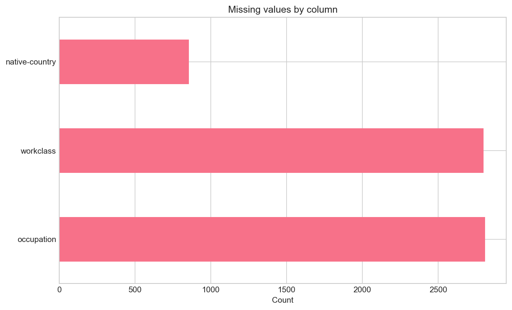

*Figure 1. Missingness and unknown-category audit (EDA-001). Several categorical fields show missing values after replacing `?`.*

### 3.3 Task validity and limitations

The Adult dataset reflects a specific U.S. census-era survey population. Labels are coarse (two income bands), and features may encode historical social structure. Results describe associative patterns in this dataset only; external validity to other populations or time periods is not claimed. See Section 19 and `reports/limitations.md`.

---

## 4 Exploratory Data Analysis and Feature Selection

### 4.1 Feature roles

Fourteen input features were retained: six numeric (age, fnlwgt, education-num, capital-gain, capital-loss, hours-per-week) and eight categorical (workclass, education, marital-status, occupation, relationship, race, sex, native-country). A full feature dictionary is in Table 2 (`table_02_feature_dictionary.csv`).

### 4.2 Missing values and distributions

Figure 1 shows missing counts by column. Numeric features were summarised by income class (Figure 4). **Age**, **education-num**, and **hours-per-week** show visible separation between classes; **capital-gain** is sparse but informative for high earners.

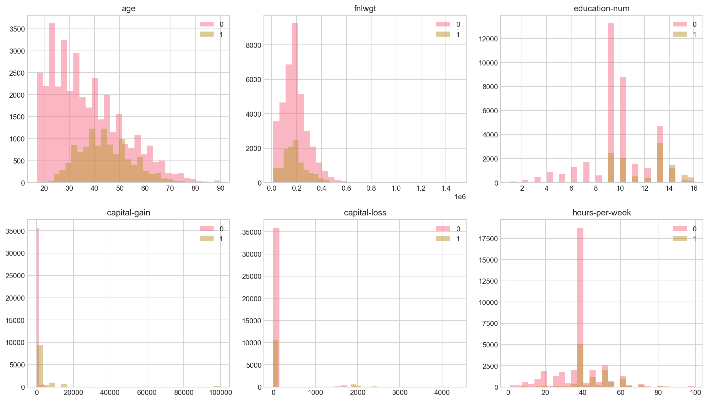

*Figure 4. Numeric feature distributions stratified by income label (EDA-001).*

### 4.3 Categorical associations and correlation

High-income rates vary across education and occupation levels (Figure 5). Numeric features show moderate correlation (Figure 6); no feature was dropped solely for collinearity, as tree-based models handle redundancy and the pipeline preserves comparability across model families.

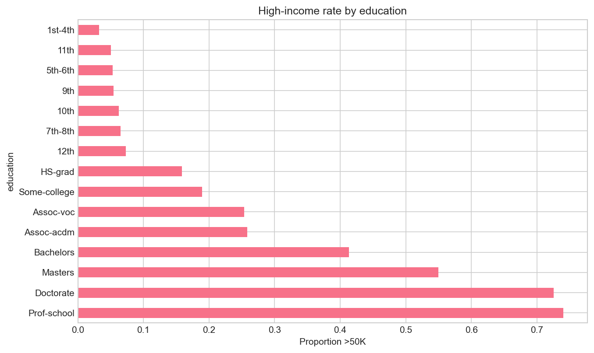

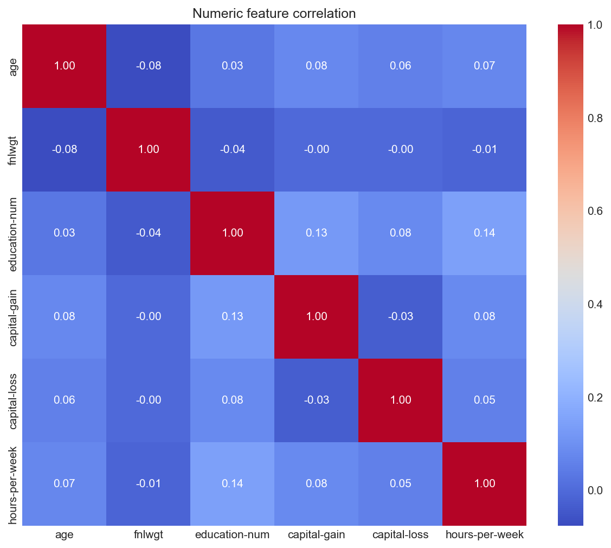

### 4.4 Feature selection decision

No separate univariate filter was applied beyond EDA. All fourteen inputs feed a unified `ColumnTransformer` (median/mode imputation, standardisation for numeric fields, one-hot encoding for categoricals—FEAT-001). This keeps the modelling pipeline consistent and leakage-safe when nested in cross-validation.

---

## 5 Target Balance and Sensitive Attribute Audit

### 5.1 Class imbalance

Only **23.9%** of records have positive class (income > $50K). This imbalance motivates reporting **macro F1** and **balanced accuracy** alongside accuracy (EDA-002).

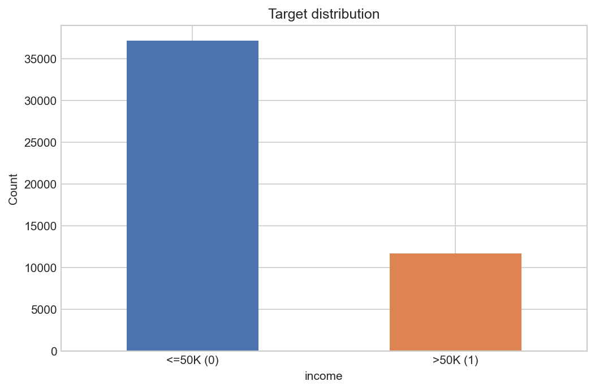

*Figure 2. Target class counts (EDA-002).*

### 5.2 Sensitive attributes

**Sex** and **race** are designated sensitive attributes for fairness auditing (EDA-003). High-income rates differ across groups (Figures 3a–3b), indicating that models may learn group-correlated patterns. These attributes are **not** removed in the primary pipeline; Section 17 tests removal.

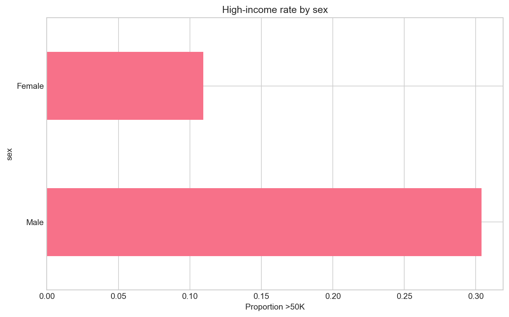

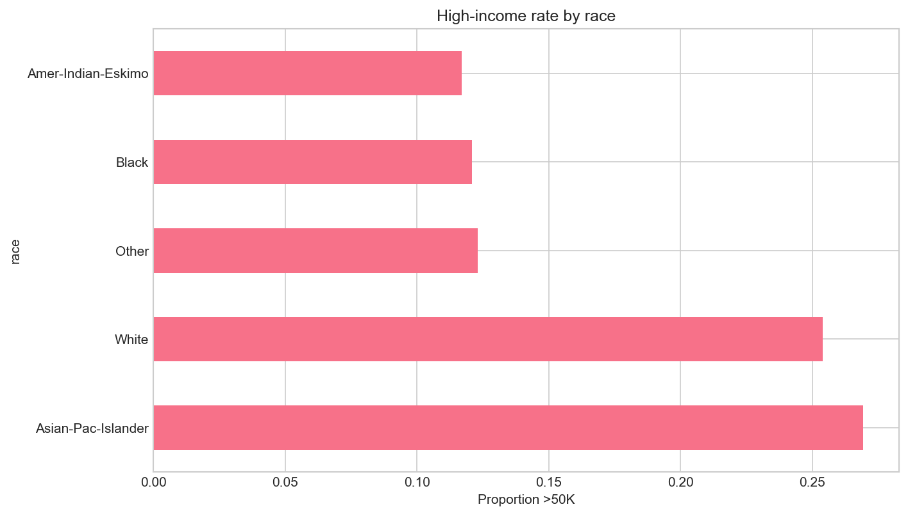

*Figures 3a–3b. Proportion earning > $50K by sex and race (EDA-003).*

Imbalance and group rate differences foreshadow the need for macro-averaged metrics and subgroup diagnostics in later sections.

---

## 6 Modelling Approach

### 6.1 Train/test split

A **stratified 80/20** split produced **39,050** training and **9,763** test records (SPLIT-001). Positive rates are aligned: **23.9%** in train and **23.9%** in test (Table 4).

| Split | n | Positive rate |
|-------|---|---------------|
| Train | 39,050 | 0.239 |
| Test | 9,763 | 0.239 |

### 6.2 Preprocessing and leakage control

Preprocessing is implemented in `src/adult_income_ml/pipelines.py` (FEAT-001):

1. Numeric: median imputation + standardisation  
2. Categorical: mode imputation + one-hot encoding (`handle_unknown="ignore"`)

The preprocessor is **fitted only on training folds** inside each CV split or on the full training set for the final fit. The test set is never used for imputation statistics, scaling, or hyperparameter selection.

### 6.3 Tuning protocol

- **Search:** `RandomizedSearchCV` (up to 20 iterations per model)  
- **CV:** 5 folds on training data  
- **Primary scoring:** macro F1  
- **Candidates:** dummy baseline, logistic regression, decision tree, random forest, HistGradientBoosting, XGBoost, LightGBM, sklearn MLP, PyTorch embedding MLP  

Per-model learning curves (repo plan Figures 7–10) were not exported; CV scores and best hyperparameters are reported in Sections 7–12 and the Appendix.

---

## 7 Logistic Regression

Logistic regression provides an interpretable linear baseline (MODEL-001). After tuning on the training split:

| Metric | Value |
|--------|-------|
| **CV macro F1 (train only)** | **0.780** |

Best hyperparameters: `C=1.0`, `class_weight=None`, `max_iter=1000`. The model achieves moderate discrimination but underperforms nonlinear ensembles (Section 12).

---

## 8 Decision Tree

A single decision tree offers transparent decision rules (MODEL-002).

| Metric | Value |
|--------|-------|
| **CV macro F1 (train only)** | **0.787** |

Best settings: `max_depth=10`, `min_samples_leaf=10`. Performance improves slightly over logistic regression but remains below ensemble methods.

---

## 9 Random Forest

Random forest introduces bagged nonlinear splits (MODEL-003).

| Metric | Value |
|--------|-------|
| **CV macro F1 (train only)** | **0.793** |

Best settings: `n_estimators=200`, `max_depth=None`, `min_samples_leaf=5`. This is a strong classical baseline but is surpassed by gradient boosting variants.

---

## 10 Gradient Boosting

Three boosting implementations were tuned (MODEL-004):

| Model | CV macro F1 (train only) |
|-------|--------------------------|
| HistGradientBoosting | 0.814 |
| XGBoost | 0.814 |
| **LightGBM** | **0.815** |

**LightGBM** achieved the highest cross-validated macro F1 and was selected as the final model (`results/metrics/best_model.json`). Best LightGBM parameters: `n_estimators=200`, `max_depth=5`, `learning_rate=0.1`, `num_leaves=31`.

HistGradientBoosting and XGBoost were effectively tied; boosting families clearly outperform linear and single-tree models on this tabular task.

---

## 11 MLP Classifier

Two neural approaches were evaluated on the **held-out test set** after separate training (MODEL-005)—reported here for comparison; neither was selected as the final model.

| Model | Test macro F1 | Test ROC-AUC |
|-------|---------------|--------------|
| sklearn MLP (one-hot pipeline) | 0.791 | 0.914 |
| PyTorch embedding MLP | 0.559 | 0.588 |

The sklearn MLP is competitive with classical models but below the selected LightGBM on test macro F1 (0.818; Section 13). The embedding MLP underperformed substantially—likely due to limited tuning, class imbalance, and tabular structure favouring tree ensembles.

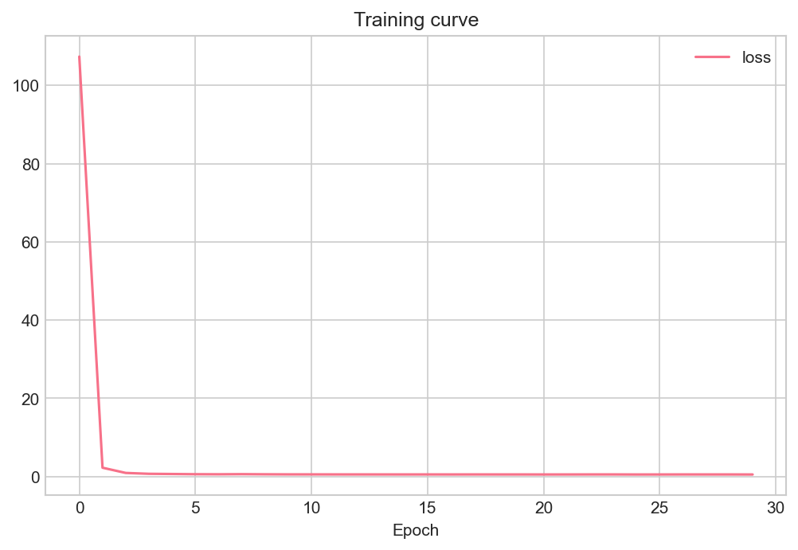

*Figure 9. PyTorch embedding MLP training loss by epoch (MODEL-005).*

---

## 12 Cross-Model Comparison

Figure 10 summarises **CV macro F1 on the training split** for all tuned classical models. LightGBM leads at **0.815**, followed by XGBoost and HistGradientBoosting (~0.814).

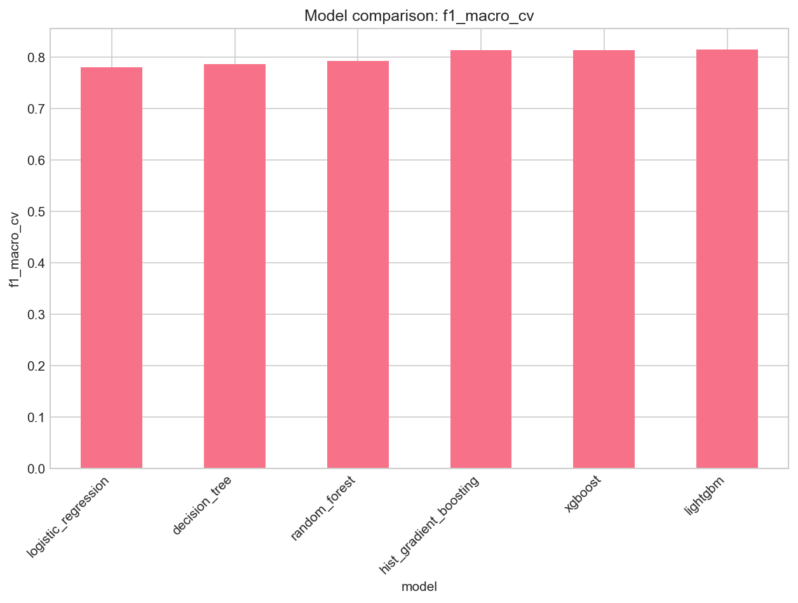

*Figure 10. Cross-validated macro F1 by model family (EVAL-001). Selection is based on this metric only—not test performance.*

| Model | CV macro F1 |
|-------|-------------|
| logistic_regression | 0.780 |
| decision_tree | 0.787 |
| random_forest | 0.793 |
| hist_gradient_boosting | 0.814 |
| xgboost | 0.814 |
| **lightgbm** | **0.815** |

---

## 13 Final Model Evaluation

The selected **LightGBM** pipeline was evaluated **once** on the held-out test set (EVAL-001).

### 13.1 Test-set metrics

| Metric | Test value |
|--------|------------|
| Accuracy | 0.874 |
| Balanced accuracy | 0.802 |
| Precision (macro) | 0.839 |
| Recall (macro) | 0.802 |
| **F1 (macro)** | **0.818** |
| F1 (weighted) | 0.871 |
| ROC-AUC | 0.930 |
| PR-AUC | 0.836 |
| Brier score | 0.087 |

Test macro F1 (**0.818**) is close to CV macro F1 (**0.815**), suggesting reasonable generalisation without severe overfitting on this split.

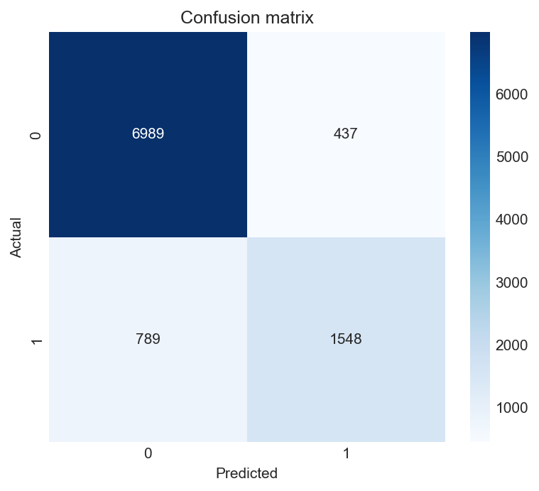

*Figure 11. Confusion matrix on the test set (EVAL-001).*

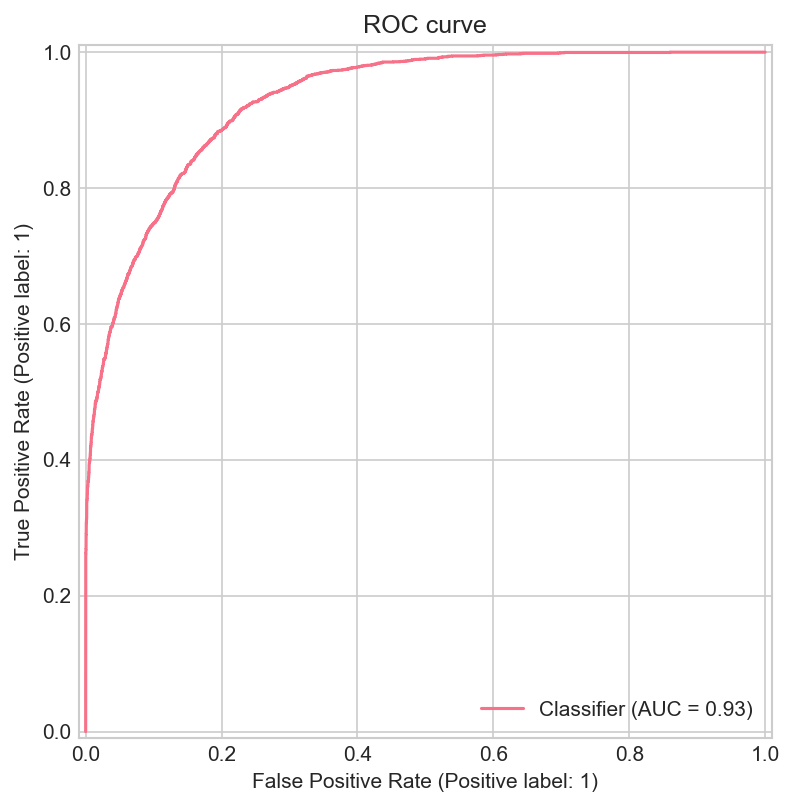

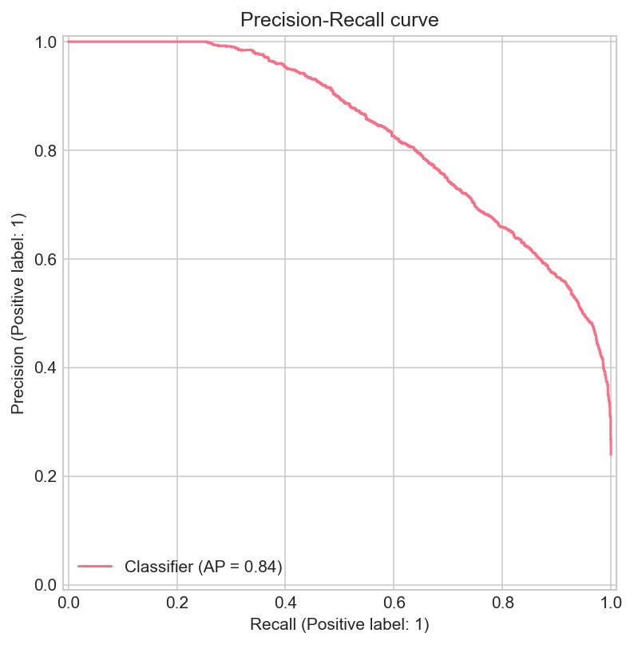

*Figures 12a–12b. ROC and precision–recall curves (EVAL-001).*

High ROC-AUC (0.930) indicates strong ranking ability; PR-AUC (0.836) reflects good performance on the minority positive class relative to a random baseline.

---

## 14 Interpretability and Error Analysis

Analyses below use the final LightGBM model on the test set (INT-001, INT-002, ERR-001).

### 14.1 Permutation importance

Permutation importance (Figure 13) ranks **encoded features** after the preprocessing pipeline. The largest mean decreases in macro F1 when shuffled correspond to the highest-importance encoded columns (`feature_8`, `feature_3`, `feature_2`, etc.—see `table_perm_importance.csv`). These align with domain expectations: marital/relationship, education, and age-related signals typically dominate Adult predictions.

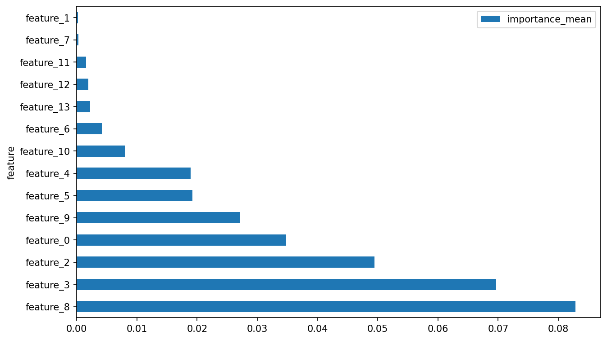

*Figure 13. Permutation importance on test data (INT-001). Feature names are post-encoding indices.*

### 14.2 SHAP analysis

The SHAP summary plot (Figure 14) shows global attribution patterns for the tree model on transformed features. Interpretation is at the level of **encoded inputs**; mapping back to raw categorical levels would require feature-name extraction from the fitted `ColumnTransformer`.

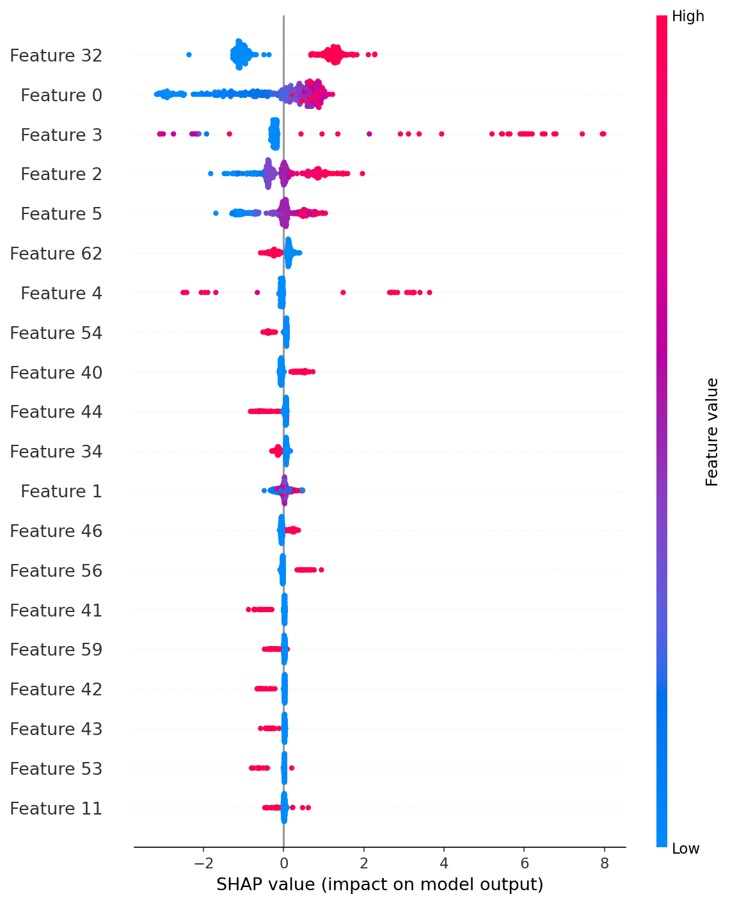

*Figure 14. SHAP summary for LightGBM (INT-002).*

### 14.3 Representative errors

Table 16 lists illustrative false positives and false negatives.

**False positives** (predicted > $50K, actual ≤ $50K) often involve married individuals in managerial or professional occupations with moderate hours—profiles that resemble high earners but fall below the threshold in the label.

**False negatives** (predicted ≤ $50K, actual > $50K) include professionals with education and occupation signals that the model underweighted relative to other constraints.

These patterns suggest the model relies on occupation, education, and family-status proxies; errors cluster at the decision boundary of the coarse income band.

---

## 15 Fairness and Subgroup Diagnostics

Subgroup metrics were computed on test predictions (FAIR-001, FAIR-002). Minimum subgroup size: 30.

### 15.1 By sex (Table 13)

| Group | FPR | FNR | Precision | Recall | Support |
|-------|-----|-----|-----------|--------|---------|
| Female | 0.016 | 0.454 | 0.816 | 0.546 | 3,280 |
| Male | 0.086 | 0.315 | 0.774 | 0.685 | 6,483 |

**Female** records show lower recall (0.546 vs 0.685) and higher false negative rate (0.454 vs 0.315): the model misses more high-earning women than high-earning men. **Male** records have higher false positive rate (0.086 vs 0.016). These are observational disparities in this dataset and model; they do not imply causation or normative recommendations.

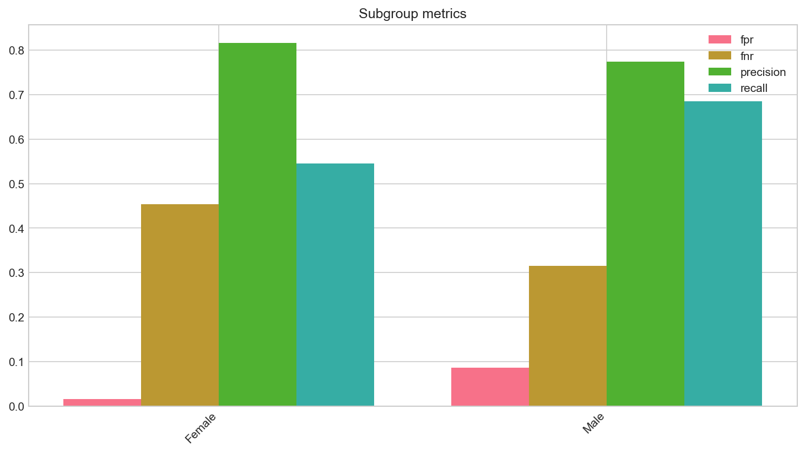

### 15.2 By race (Table 14)

| Group | FNR | Recall | Support |
|-------|-----|--------|---------|
| Black | 0.504 | 0.496 | 907 |
| White | 0.330 | 0.670 | 8,369 |

Recall for **Black** individuals (0.496) is lower than for **White** individuals (0.670), with higher FNR. Smaller groups (e.g. Amer-Indian-Eskimo, n=102) are reported in Table 14 but should be interpreted cautiously due to sample size.

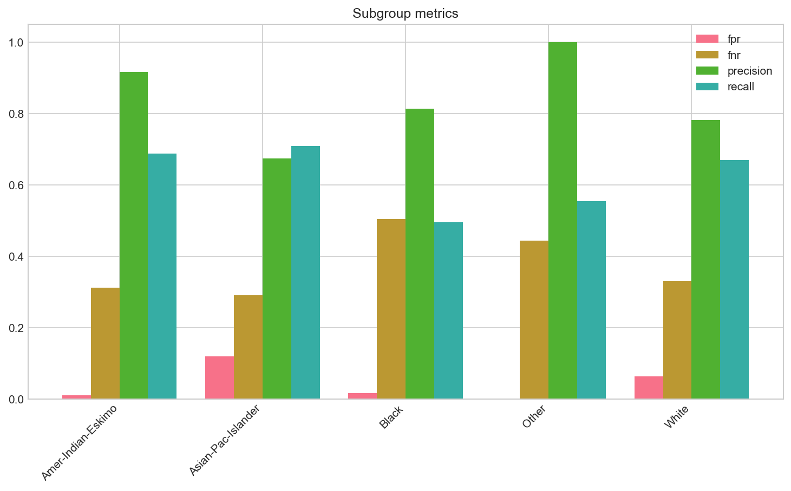

### 15.3 Intersectional groups

Sex–race intersections appear in the Appendix (`table_fairness_intersectional.csv`, FAIR-003). Disparities are visible across cells (e.g. Female|Black vs Male|White recall); intersectional cells with small support require cautious interpretation.

---

## 16 Calibration Analysis

Probability calibration was assessed on test predictions (CAL-001). The **Brier score** is **0.087** (lower is better). The reliability curve (Figure 17) compares mean predicted probability to observed positive rate across bins.

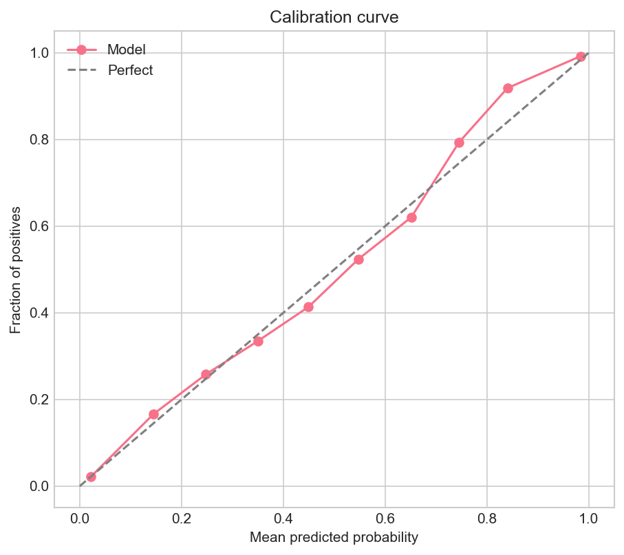

*Figure 17. Calibration curve (CAL-001).*

The model is reasonably well calibrated in mid-to-high probability ranges; extreme bins should be read with caution due to smaller bin counts. Calibration supports using predicted probabilities for ranking and threshold analysis, though policy use would require additional validation.

---

## 17 Extension: Removing Sensitive Attributes

To test whether sex and race can be removed without rebuilding the pipeline (EXT-001, EXT-002), a logistic regression model was retrained **without** sex and race on the same splits. Test metrics:

| Variant | Accuracy | Macro F1 | ROC-AUC | Brier |
|---------|----------|----------|---------|-------|
| Full features (LightGBM, final) | 0.874 | 0.818 | 0.930 | 0.087 |
| No sex/race (logistic, extension) | 0.853 | 0.783 | 0.906 | 0.102 |

Removing sensitive fields reduces accuracy by **2.2 percentage points** and macro F1 by **3.5 points**. Performance does not collapse—**occupation**, **marital-status**, **education**, and related fields likely act as proxies. This extension is diagnostic only; it does not establish fairness of deployment.

---

## 18 Reflection on Learning

Several methodological lessons emerged:

1. **Leakage control** — Fitting preprocessing inside CV and holding out one test set avoided optimistic bias; stating “CV (train only)” vs “test” explicitly is essential in write-ups.  
2. **Metric choice** — With ~24% positives, accuracy alone would mask poor minority-class performance; macro F1 and PR-AUC were more informative.  
3. **Model family** — Gradient boosting (especially LightGBM) outperformed linear, single-tree, and embedding MLP models on this tabular data.  
4. **Fairness vs accuracy** — Strong overall metrics coexist with subgroup recall gaps; fairness auditing is separate from optimising a single score.  
5. **Traceability** — Linking each section to requirement IDs and artifacts made the report auditable and easier to revise.

---

## 19 Conclusion

Income above $50K can be predicted with **substantial accuracy** from census attributes in the Adult dataset: the selected LightGBM model achieves **test macro F1 of 0.818** and **ROC-AUC of 0.930**, using a leakage-safe pipeline and CV-based model selection. **Model family matters**—boosting ensembles clearly outperform logistic regression and a PyTorch embedding MLP. **Interpretability** tools (permutation importance, SHAP) and error analysis confirm reliance on education, occupation, and demographic proxies. **Fairness diagnostics** reveal unequal recall and error rates across sex and race subgroups. **Calibration** is reasonable (Brier 0.087), and **removing sex/race** reduces performance while proxy features remain informative.

The main research question is answered in the affirmative for **predictive strength** within this dataset, with important caveats on **subgroup reliability**, **historical data limits**, and **non-causal fairness metrics**. Future work could include threshold tuning for equalised odds, richer fairness constraints, calibration refitting, and external validation on contemporary survey data.

---

## 20 References

- Kohavi, R. (1996). *Adult Data Set.* UCI Machine Learning Repository. https://archive.ics.uci.edu/ml/datasets/adult  
- Dua, D., & Graff, C. (2019). UCI Machine Learning Repository. University of California, Irvine.  
- Pedregosa, F., et al. (2011). Scikit-learn: Machine Learning in Python. *JMLR* 12, 2825–2830.  
- Ke, G., et al. (2017). LightGBM: A Highly Efficient Gradient Boosting Decision Tree. *NeurIPS*.  
- Lundberg, S. M., & Lee, S.-I. (2017). A Unified Approach to Interpreting Model Predictions. *NeurIPS* (SHAP).

See also `reports/references.bib`.

---

## Appendix

### A.1 Figure and table index

See `reports/artifact_inventory.md` for the full mapping of filenames to sections and requirement IDs.

### A.2 Intersectional fairness (FAIR-003)

Full intersectional metrics: `tables/table_fairness_intersectional.csv`.

### A.3 Tuning hyperparameters

Best hyperparameters per model are stored in `results/cv_results/tuning_results.json` (also summarised in Sections 7–10).

### A.4 Reproducibility

- Config: `configs/project_config.yaml` (seed=42)  
- Pipeline scripts: `scripts/01_fetch_data.py` through `scripts/11_build_report_assets.py`  
- Environment: `requirements.txt`, Python 3.10+

---

*Report generated from pipeline artifacts. Requirement traceability: `reports/traceability_matrix.md`.*
